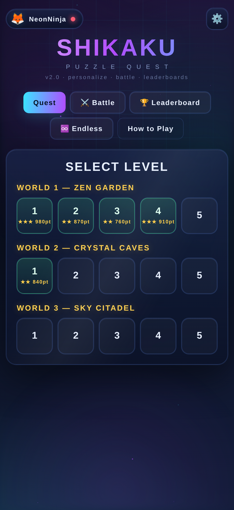
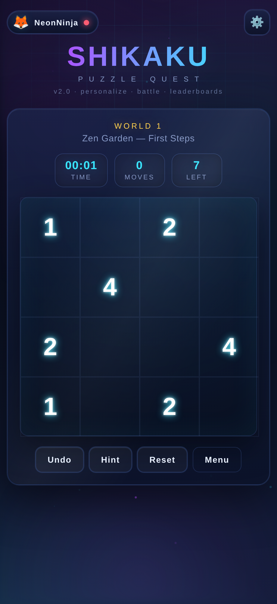
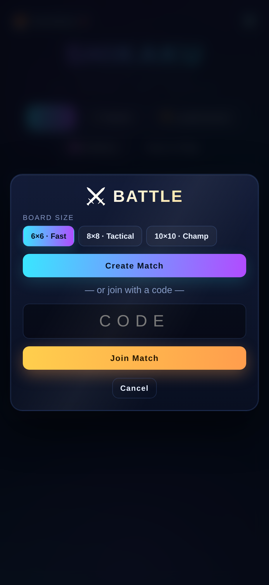
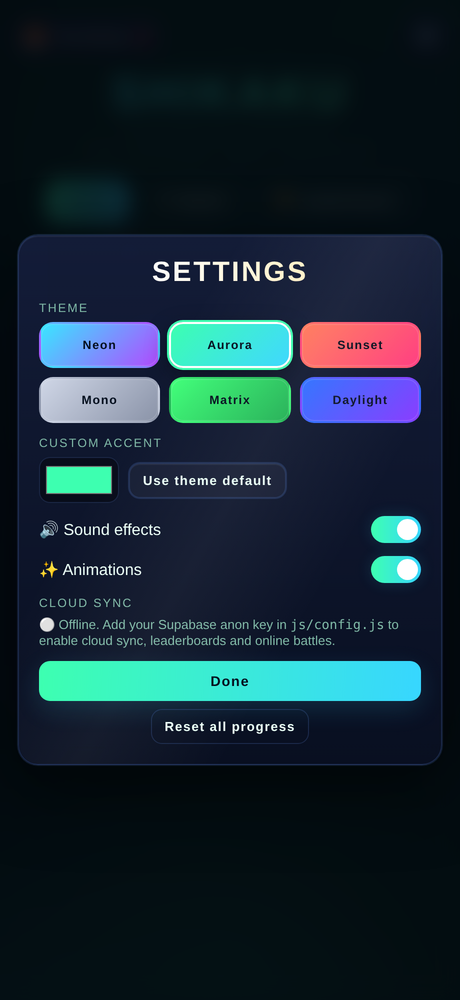
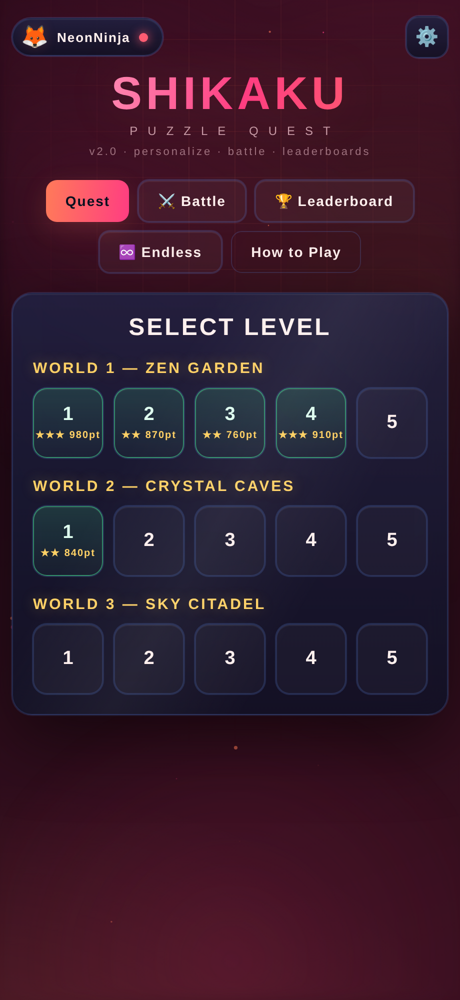
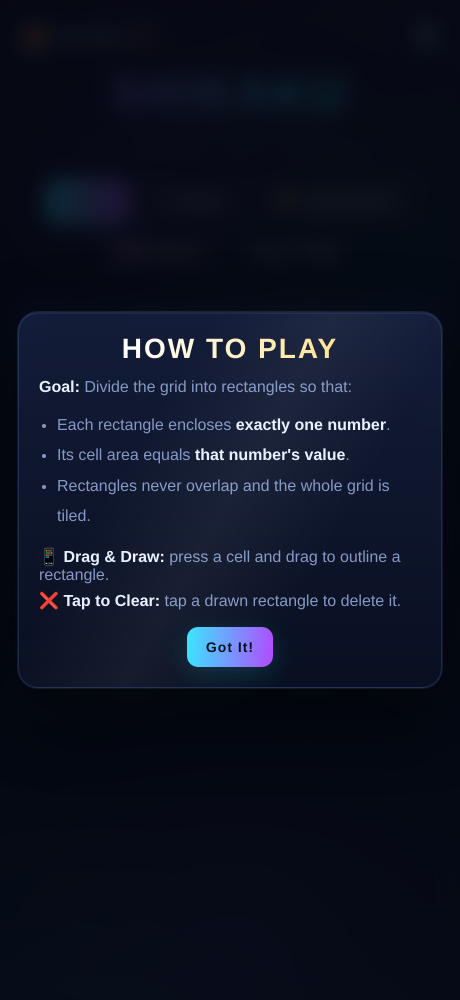

<div align="center">

# 🟦 SHIKAKU — Puzzle Quest

### A neon, cloud-connected take on the classic Japanese logic puzzle — solo quest, real-time 1v1 battles, leaderboards, themes, and an endless generator.

[](https://shikaku-quest-three.vercel.app)
[](https://github.com/DansiDanutz/Game1/actions/workflows/ci.yml)
[](LICENSE)
[](#-tech-stack)
[](https://supabase.com)

<br/>





</div>

---

## 📖 What is Shikaku?

**Shikaku** (四角, "divide into rectangles") is a logic puzzle. You split a grid into
rectangles so that:

- each rectangle contains **exactly one number**,
- the rectangle's **area equals that number**,
- rectangles never overlap and the whole grid is covered.

This project takes that pure logic core and wraps it in a **premium arcade
experience**: a neon glass UI, player profiles, six color themes, cloud
leaderboards, and **live head-to-head battles**.

> **▶ Play it now:** **https://shikaku-quest-three.vercel.app**
>
> _First launch shows a one-time "choose your name + avatar" screen — enter a name and tap **Save** to start playing._

---

## ✨ Features

### 🎯 Gameplay
- **Quest mode** — 3 worlds × 5 levels with a difficulty curve. Each level draws a **fresh, random board from a bank of 100+ puzzles with verified _unique_ solutions**, so it's never the same twice.
- **♾️ Endless mode** — an infinite supply of randomly generated boards (every one provably solvable, because the generator builds the solution first).
- Drag-to-draw rectangles · tap-to-clear · **undo / reset / hint**.
- Live **timer, move counter, and clues-remaining** HUD.
- Score with **time + accuracy bonuses**, star ratings, and a **confetti** finish.

### ⚔️ Multiplayer — Battle Arena
- **Real-time 1v1 races** on an identical board.
- Create a room, share a **4-letter code**, first to tile the grid **wins**.
- **Live opponent progress bar**, disconnect detection (you win if they bail), and a join timeout for bad codes.
- Powered by **Supabase Realtime broadcast** — no servers to run.

### 🎨 Personalization
- **Player profile** — pick a display name and avatar.
- **Theme switcher** — Neon · Aurora · Sunset · Mono · Matrix · Daylight, plus a **custom accent color**.
- **Settings** — toggle sound effects (Web Audio) and animations; everything persists.

### ☁️ Cloud
- **Cloud progress** — best scores follow you across devices.
- **Global leaderboards** — Quest score and Battle wins, with medal-ranked top three.
- Lightweight **username-only** identity (device UUID, no passwords).
- **Graceful offline mode** — with no Supabase key the game is still fully playable on `localStorage`.

---

## 📸 Screenshots

| Personalize | Theme switch | How to play |
|:---:|:---:|:---:|
|  |  |  |

---

## 🕹️ How to play

1. **Pick a name & avatar** on first launch.
2. **Quest** → choose a level. **Press and drag** across cells to outline a rectangle.
3. A rectangle turns **green** when it's valid (one number inside, area = number) and **red** when it isn't.
4. **Tap a rectangle** to delete it. Use **Hint** if you're stuck.
5. Tile the whole grid to win — faster + fewer moves = more points and more stars.

**Battle:** `⚔️ Battle` → choose a size → **Create Match** → share the code. Your friend taps **Join**, and you race the same board live.

---

## 🧱 Tech stack

- **Vanilla HTML, CSS, and JavaScript** — no framework, no build step.
- **Canvas** for the animated starfield background and confetti.
- **[Supabase](https://supabase.com)** — Postgres + Row Level Security for profiles/leaderboards, and Realtime broadcast for battles (loaded from CDN).
- **Vercel** for static hosting and Git-connected deploys.

### Project structure

```
.
├── index.html              # screens, modals, canvases
├── css/styles.css          # design system + 6 themes
├── js/
│   ├── config.js           # Supabase URL + publishable key
│   ├── cloud.js            # Supabase wrapper (no-ops when offline)
│   ├── puzzle.js           # levels + constructive puzzle generator
│   ├── effects.js          # starfield + confetti (canvas)
│   └── app.js              # game, profile, themes, settings, leaderboard, battle
├── schema.sql              # Supabase tables + RLS policies
├── tools/                  # dev scripts (level generation, screenshots, CI check)
├── docs/screenshots/       # README images
└── vercel.json             # static deploy config
```

---

## 🚀 Getting started (local)

No dependencies — just serve the folder so the scripts load over HTTP:

```bash
git clone https://github.com/DansiDanutz/Game1.git
cd Game1
python3 -m http.server 8000
# open http://localhost:8000
```

The game runs **fully offline** out of the box. To enable cloud features locally, follow the Supabase setup below.

---

## 🗄️ Supabase setup

1. In your Supabase project, open **SQL Editor → New query**, paste [`schema.sql`](schema.sql), and **Run**. It creates the `profiles` and `scores` tables with public (username-only) RLS policies. It's idempotent — safe to re-run.
2. Copy your **publishable** key from **Project Settings → API**.
3. Paste it into [`js/config.js`](js/config.js):

   ```js
   window.SHIKAKU_CONFIG = {
     SUPABASE_URL: "https://YOUR-PROJECT.supabase.co",
     SUPABASE_ANON_KEY: "sb_publishable_..."   // safe to ship; bound by RLS
   };
   ```

Multiplayer uses ephemeral Realtime **broadcast** channels (`match:<CODE>`) and needs no extra setup.

> **Security note:** identity is username-only (a device UUID, no passwords), so the RLS policies allow public read/write on these two tables. That's appropriate for a casual public leaderboard — don't store anything sensitive.

---

## ☁️ Deployment

The repo is a static site (no build), so it deploys anywhere. It's live on Vercel and **auto-deploys on every push to `main`** via the Vercel ↔ GitHub integration.

- **Production:** https://shikaku-quest-three.vercel.app

Deploy your own:

```bash
npm i -g vercel
vercel --prod        # Framework preset: Other · Root: ./ · no build
```

---

## 🗺️ Roadmap

- [ ] Daily challenge with a shared seed + global ranking
- [ ] Best-of-3 battle series and rematch flow
- [ ] Solver-backed "unique solution" guarantee for generated boards
- [ ] PWA / offline install
- [ ] Optional Supabase Auth for claimed profiles

---

## 🤝 Contributing

Contributions welcome — see [CONTRIBUTING.md](CONTRIBUTING.md). Keep it
dependency-free, match the existing vanilla style, and make sure
`node tools/ci-check.js` and `node --check js/*.js` pass (CI enforces both).

---

## 📄 License

[MIT](LICENSE) © DansiDanutz
